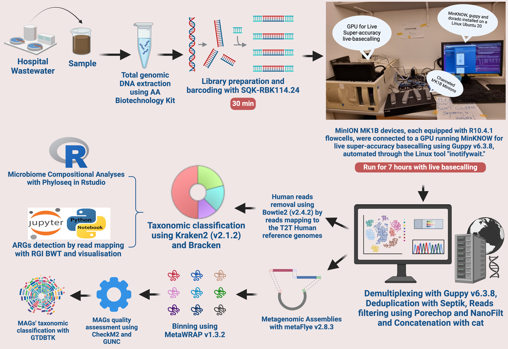

## Pipeline Flow Diagram

**Figure:** Overview of the Long-Read Metagenomic Analysis Pipeline.

# **Long-Read Metagenomic Analysis Pipeline**

# **Overview**

This repository contains a complete pipeline for analyzing long-read metagenomic data generated from Nanopore sequencing. The pipeline covers demultiplexing, quality control, host genome removal (like human or animal), taxonomic classification, abundance estimation, and antimicrobial resistance gene (ARG) detection. The analysis is completed using both R and Jupyter Notebook for comprehensive data visualization.

# **Directory Structure**

**Long-Read Metagenomic Analysis Pipeline/**

a. scripts/                      # Shell scripts for each analysis step

b. notebooks/                    # Jupyter Notebook for ARG analysis

c. R_analysis/                    # R Markdown file for compositional analysis

d. README.md                      # This documentation file

**Installation & Dependencies**

This pipeline requires the following tools:

Conda/Mamba for environment management

Guppy for demultiplexing

SeqKit for deduplication

Filtlong for quality filtration

Minimap2 & Samtools for host genome removal

Kraken2 & Bracken for taxonomic classification and abundance estimation

RGI for ARG detection

Jupyter Notebook and R for downstream analysis

**Setting Up the Environment**

You can set up the environment with Conda:

conda create -n icrect_env guppy seqkit filtlong minimap2 samtools kraken2 bracken rgi jupyter r-essentials

conda activate icrect_env

# Pipeline Workflow (Individual Steps)

**1. Demultiplexing**

Demultiplex the raw reads using Guppy:

bash scripts/demultiplex.sh

Output: results/demultiplexed/

**2. Deduplication**

Remove duplicate reads using SeqKit:

bash scripts/deduplicate.sh

Output: results/deduplicated/

**3. Quality Filtration**

Filter low-quality reads using Filtlong:

bash scripts/filter.sh

Output: results/filtered/

**4. Host Genome Removal**

Align reads to the host genome and filter out host-aligned reads using Minimap2 and Samtools:

bash scripts/host_removal.sh

Output: results/host_removed/

**5. Taxonomic Classification with Kraken2**

Classify reads using Kraken2:

bash scripts/kraken_classification.sh

Output: results/kraken_results/

**6. Abundance Estimation with Bracken**

Refine taxonomic classification using Bracken:

bash scripts/run_bracken.sh

Output: results/bracken_results/

**7. Export to BIOM Format**

Convert the Bracken results to a BIOM format for R analysis:

bash scripts/export_biom.sh

Output: results/biom_output/icrect_biom.json

**8. R Analysis (Compositional Analysis)**

Run the R Markdown file for compositional analysis using Phyloseq:

Rscript -e "rmarkdown::render('R_analysis/ICRECT_hww_biom.Rmd')"

Output: R_analysis/ICRECT_hww_biom.html

**9. Jupyter Notebook Analysis (ARG Detection)**

Run the Jupyter Notebook for antimicrobial resistance gene (ARG) analysis:

conda activate icrect_env

jupyter nbconvert --execute notebooks/ARG_Mapping_rgi_bwt_ONT.ipynb --to html

Output: notebooks/ARG_Mapping_rgi_bwt_ONT.html

# **RUNNING THE FULL PIPELINE WITH MASTER SCRIPT**

You can run the entire pipeline in one command using the master script (run_pipeline.sh):

How to Use the Master Script:

Activate the conda environment and run the master script:

conda activate icrect_env

./run_pipeline.sh

The master script runs all steps sequentially and saves the results in the results/ folder.

**Expected Output**

The pipeline generates the following outputs:

Demultiplexed and deduplicated FASTQ files

Filtered reads and cleaned BAM files

Taxonomic classification reports (*_report.txt)

Abundance estimates (*_bracken.txt)

BIOM file for R analysis (icrect_biom.json)

Compositional analysis report (ICRECT_hww_biom.html)

ARG analysis report (ARG_Mapping_rgi_bwt_ONT.html)

**Troubleshooting**

Ensure that input directories and filenames match those specified in the scripts.

Activate the correct conda environment before running any script:

conda activate icrect_env

**Contributing**

Contributions are welcome! Please fork the repository, make your changes, and submit a pull request.
